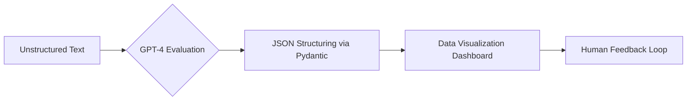
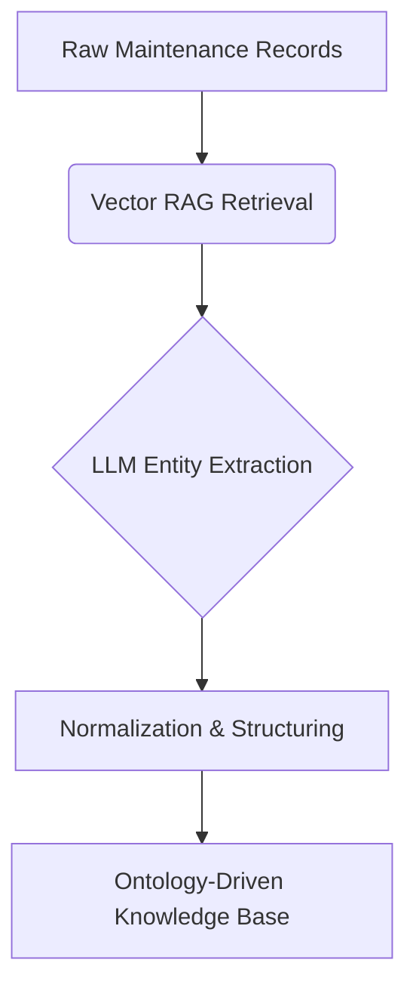

# 📊 AI-Driven Technical Document Audit & Evaluation

## 💡 Project Overview
반도체 장비 기술 에스컬레이션(Technical Escalation) 데이터의 품질 평가 Workflow를 LLM을 통해 자동으로 평가하고 시각화하는 솔루션입니다.

## 🚀 Key Impact
- **Efficiency:** 수동 Audit의 **87% 자동화** 및 주당 **10시간 이상의 업무 시간 절감** (PBG별) 
- **Speed:** 연간 28,000건의 데이터 검토 시간을 **80% 이상 단축** 
- **Accuracy:** 프롬프트 엔지니어링 및 피드백 루프를 통해 **90% 이상의 정확도** 달성 

## 🖼️ Visualization (UI)
회사 보안 정책 상 시각화 자료를 업로드 하지 못합니다

## ⚙️ Technical Workflow

# 🛠️ Domain-Specific Entity Extraction Pipeline

## 💡 Project Overview
비정형 유지보수 기록에서 반도체 도메인 특화 엔티티를 자동으로 추출하고 정규화하여 **온톨로지 기반의 지식 자산**으로 변환하는 파이프라인입니다. 

## 🚀 Key Value
- **Assetization:** 산재된 비정형 데이터를 실행 가능한 조직의 지식 자산(Knowledge Assets)으로 구조화 
- **Technology:** Vector RAG와 LLM을 결합하여 고도화된 엔티티 추출 및 정규화 수행 

## 🖼️ Pipeline UI / Process
※ 보안 정책에 따라 민감 정보는 마스킹 처리되었습니다.

## ⚙️ Architecture

